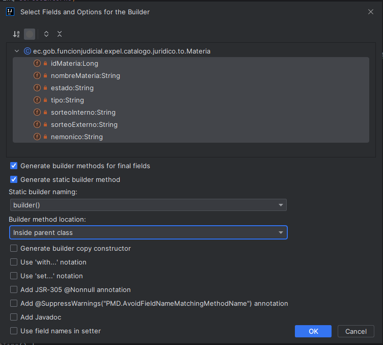

# Creación de builders en clases TO

Para la creación de los builders que se debe seleccionar el nombre de la clase To con el botón derecho del mouse,
seleccionar la opción


# Microservicio ubicación

# Colección de postman
En la carpeta docs/postman, se encuentra la colección de postman con los ejemplos de uso del api rest para el microservicio ubicación.
> docs/postman/EXPEL.postman_collection.json

# Resolución de erroes
En el caso de tener el siguiente error:

```log
Name:dataSource, Connection:3, Time:8, Success:False
Type:Prepared, Batch:False, QuerySize:1, BatchSize:0
Query:["select paisentity0_.[id_pais] as id_pais1_1_, paisentity0_.[nacionalidad] as nacional2_1_, paisentity0_.[nombre_pais] as nombre_p3_1_ from [CLEX1].[pais] paisentity0_ where paisentity0_.[id_pais]=?"]
Params:[(ECU)]
2023-03-27 09:36:42 - SQL Error: 207, SQLState: S0001
2023-03-27 09:36:42 - El nombre de columna 'id_pais' no es válido.
2023-03-27 09:36:42 - Servlet.service() for servlet [dispatcherServlet] in context with path [] threw exception [Request processing failed; nested exception is org.springframework.dao.InvalidDataAccessResourceUsageException: could not extract ResultSet; SQL [n/a]; nested exception is org.hibernate.exception.SQLGrammarException: could not extract ResultSet] with root cause
com.microsoft.sqlserver.jdbc.SQLServerException: El nombre de columna 'id_pais' no es válido.
````

Se debe tener la siguiente configuración en el archivo application.yml, basada en los siguientes links:
* https://thorben-janssen.com/naming-strategies-in-hibernate-5/
* https://www.baeldung.com/hibernate-field-naming-spring-boot

```properties
spring=
jpa=
hibernate=
naming=
physical-strategy=org.hibernate.boot.model.naming.PhysicalNamingStrategyStandardImpl
implicit-strategy=org.hibernate.boot.model.naming.ImplicitNamingStrategyJpaCompliantImpl
dialect=org.hibernate.dialect.SQLServerDialect
properties=
hibernate=
default_schema='CLEX1'
globally_quoted_identifiers=true
physical_naming_strategy=org.springframework.boot.orm.jpa.hibernate.SpringPhysicalNamingStrategy
```
Agregar esa configuración en el archivo application.yml cambiará las estrategias de nomenclatura de Hibernate para que sean compatibles con JPA. La configuración que has establecido en el archivo application.yml hará lo siguiente:

* PhysicalNamingStrategyStandardImpl: Hibernate utilizará esta estrategia para convertir los nombres de las tablas y columnas en la base de datos a nombres de identificadores físicos (nombres reales de tablas y columnas en la base de datos) sin cambiarlos.

* ImplicitNamingStrategyJpaCompliantImpl: Hibernate utilizará esta estrategia para generar nombres de identificadores implícitos (cuando no se especifica un nombre explícito mediante anotaciones) de acuerdo con las reglas de JPA.

Si esta configuración ha resuelto el problema del error org.hibernate.AnnotationException: No identifier specified for entity, entonces significa que el problema estaba relacionado con las estrategias de nomenclatura en lugar de la configuración de la entidad. Esto puede suceder si Hibernate estaba utilizando una estrategia de nomenclatura diferente y no podía reconocer correctamente los identificadores de la entidad y sus atributos.

Con esta solución, la aplicación debe funcionar correctamente, y las entidades deben mapearse correctamente a las tablas y columnas de la base de datos.

# GIT

## Eliminar las carpetas y archivos que no deberían estar en el repositorio de Git

Para eliminar las carpetas y archivos que no deberían estar en el repositorio de Git y agregar un archivo .gitignore para evitar que vuelvan a subirse, sigue estos pasos:

Primero, crea un archivo .gitignore en la raíz de tu proyecto si aún no lo has hecho. Puedes hacerlo con un editor de texto o desde la línea de comandos, por ejemplo:

```bash
touch .gitignore
```

Abre el archivo .gitignore y agrega las carpetas y archivos que deseas ignorar. En tu caso, serían las siguientes:

```txt
target/
.idea/
*.iml
```

Guarda y cierra el archivo .gitignore.

Ahora, necesitas eliminar las carpetas y archivos del repositorio de Git sin eliminarlos de tu sistema local. Puedes hacer esto con el siguiente comando:
```bash
git rm -r --cached target/ .idea/ *.iml
```

A continuación, agrega el archivo .gitignore al repositorio y haz un commit con los cambios:

```bash
git add .gitignore
git commit -m "Eliminadas carpetas innecesarias y agregado .gitignore"
```

Por último, sube los cambios al repositorio remoto:

```bash
git push
```

Con estos pasos, habrás eliminado las carpetas y archivos innecesarios del repositorio de Git y asegurado que no se vuelvan a subir en el futuro gracias al archivo .gitignore.